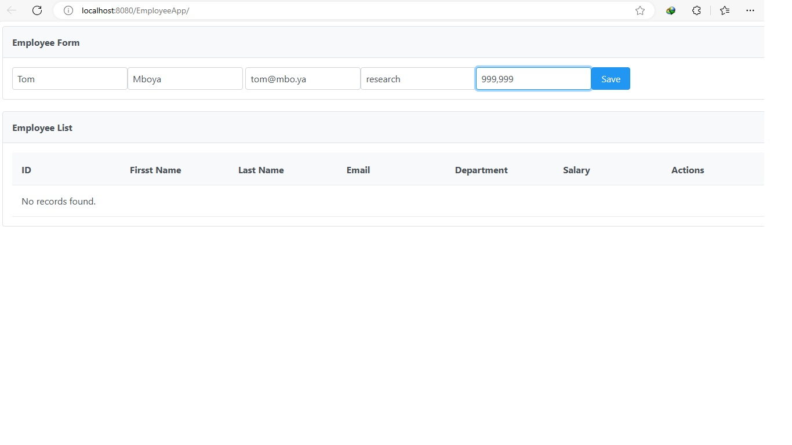
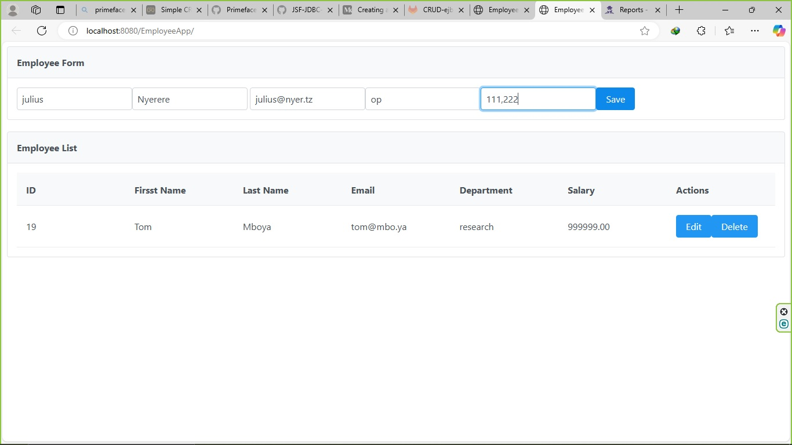
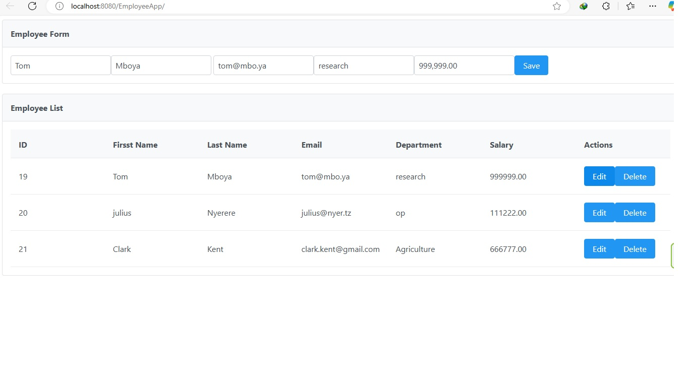
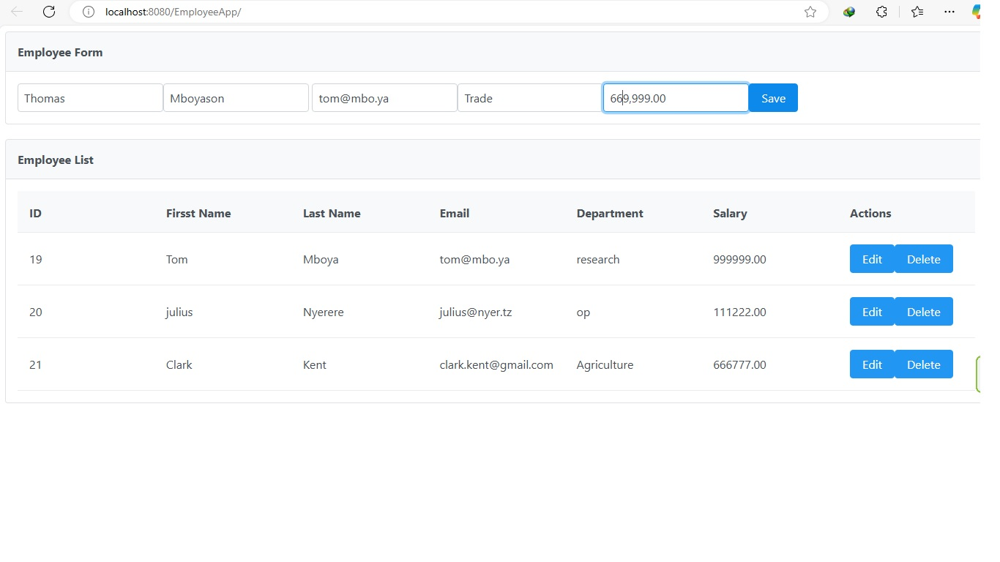
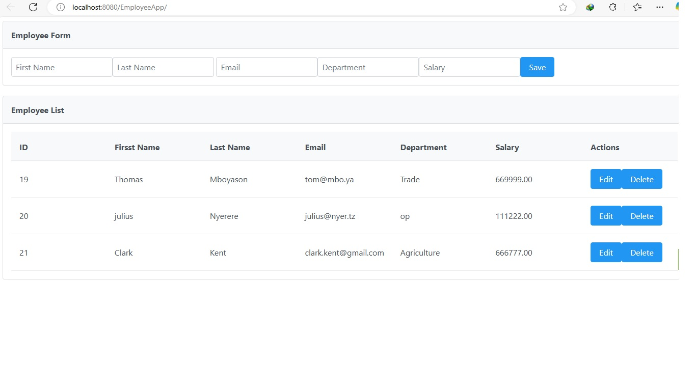
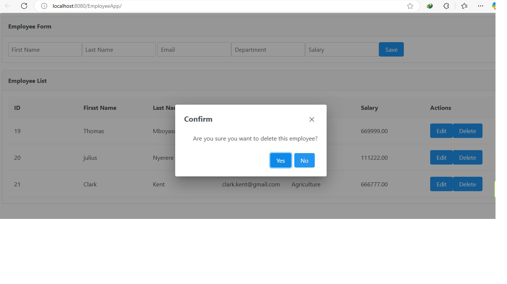
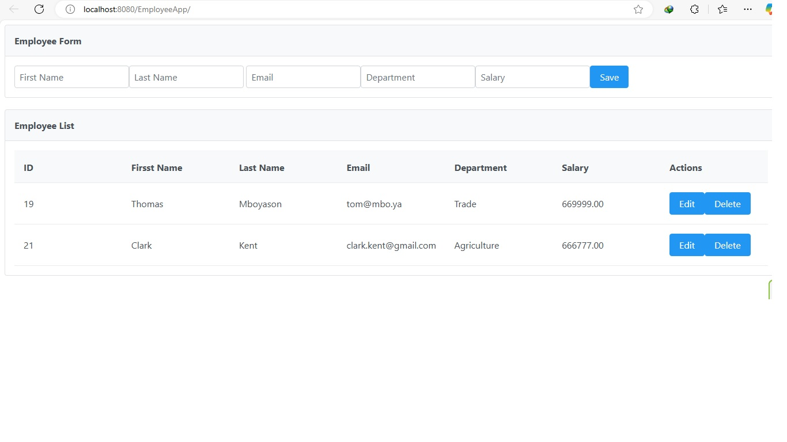
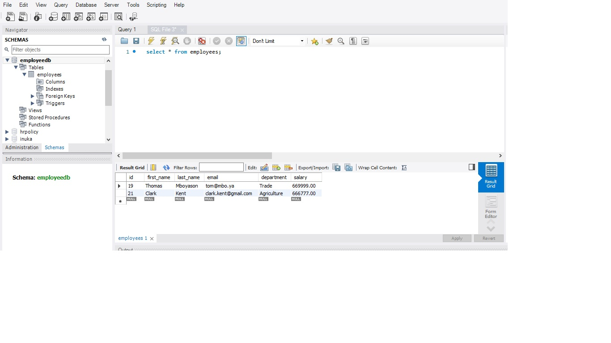

# EmployeeApp

A web-based CRUD application for managing employees, built using Java EE 8, JSF (PrimeFaces), JDBC, and deployed on Payara Server 5.

## Technologies used
- Awesome 
- Java EE 8 
- PrimeFaces
- JDBC + MySQL
- Payara Server 5
- Java 11

## Setup Instructions
#### 1. Clone the Repo
```bash
  git clone https://github.com/brayo1/EmployeeApp.git
```
##### 2. Create MySQL Database
```bash
CREATE DATABASE employeedb;

USE employeedb;

CREATE TABLE employees (
  id INT PRIMARY KEY  AUTO_INCREMENT,
  first_name VARCHAR(255) NOT NULL,
  last_name VARCHAR(255) NOT NULL,
  email VARCHAR(255) NOT NULL UNIQUE,
  department VARCHAR(255),
  salary DECIMAL(10, 2)
);
```
#### 3. Configure Database connection in DBconnection.java, use your DB username and password.
```bash
  EmployeeApp\src\main\java\com\employee\resources
```

#### 4. Add Payara Server to NetBeans
 Download Payara Server 5

In NetBeans:

Go to Tools → Servers

Click Add Server

Select Payara Server

Choose the downloaded Payara folder (e.g., payara5)

Finish setup and start the server
## Running the App
1. Open the project in NetBeans

2. Build the project: Clean and Build

3. Deploy to Payara Server 5

Access via:
```bash
http://localhost:8080/EmployeeApp
```
## Screenshots










